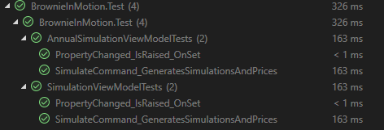

# BrownieInMotion

BrownieInMotion é uma aplicação .NET MAUI multiplataforma para simulação de movimentos brownianos (Geometric Brownian Motion), desenvolvida como parte de um teste técnico para processo seletivo. O projeto inclui interface gráfica moderna, personalização visual dos gráficos e testes unitários.

---

## Sumário

- [Descrição](#descrição)
- [Funcionalidades](#funcionalidades)
- [Tecnologias Utilizadas](#tecnologias-utilizadas)
- [Instalação e Execução](#instalação-e-execução)
- [Testes Unitários](#testes-unitários)
- [Personalização dos Gráficos](#personalização-dos-gráficos)
- [Demonstração](#demonstração)
- [Estrutura do Projeto](#estrutura-do-projeto)

---

## Descrição

O BrownieInMotion permite simular e visualizar o comportamento de ativos financeiros sob movimento browniano, tanto em escala diária quanto anual. O usuário pode ajustar parâmetros como preço inicial, volatilidade, média de retorno, número de simulações e passos, além de personalizar a aparência dos gráficos.

---

## Funcionalidades

- **Simulação Diária e Anual** de movimentos brownianos.
- **Personalização Visual** do gráfico:
  - Estilo da linha (sólida, tracejada, pontilhada)
  - Espessura da linha (slider)
  - Exibição dos pontos de máximo/mínimo (checkbox)
  - Exibição de gridlines (switch)
- **Interface Responsiva** e moderna com .NET MAUI.
- **Tooltip** ao tocar no gráfico, mostrando o valor do dia selecionado.
- **Testes Unitários** cobrindo ViewModels e lógica de simulação.

---

## Tecnologias Utilizadas

- [.NET 9](https://dotnet.microsoft.com/)
- [.NET MAUI](https://learn.microsoft.com/dotnet/maui/)
- C# 13
- xUnit (testes unitários)

---

## Instalação e Execução

1. **Pré-requisitos**:
   - [.NET 9 SDK](https://dotnet.microsoft.com/download)
   - Visual Studio 2022 (com workload MAUI instalado)

2. **Clone o repositório:**
  ```bash
  git clone https://github.com/GustaBS2003/BrownieInMotion.git
  ```

3. **Restaure os pacotes:**
  ```bash
  dotnet restore
  ```

4. **Execute a aplicação**:
- No Visual Studio, selecione o projeto `BrownieInMotion` e escolha a plataforma desejada (Android, iOS, Windows, MacCatalyst).
- Ou via terminal:
  ```bash
  dotnet build
  dotnet run --project BrownieInMotion
  ```

5. **Executando os testes unitários**:
  ```bash
   dotnet test BrownieInMotion.Test
  ```

---

## Testes Unitários

- Os testes estão localizados em `BrownieInMotion.Test`.
- Cobrem os principais ViewModels, verificando geração de simulações, notificações de propriedades e integridade dos dados.
- Exemplo de execução dos testes:



---

## Personalização dos Gráficos

- **Estilo da linha:** Sólida, tracejada ou pontilhada.
- **Espessura:** Ajustável de 1 a 5.
- **Exibir máximo/mínimo:** Mostra ou oculta os pontos extremos de cada simulação.
- **Exibir grid:** Mostra ou oculta as linhas de grade do gráfico.

---

## Demonstração

- **Gravação de tela:**  
  [Clique aqui para assistir à demonstração da aplicação](./docs/demo.mp4)

---

## Estrutura do Projeto
```bash
 BrownieInMotion/ ├── BrownieInMotion/           # Projeto principal MAUI (UI) 
                  ├── BrownieInMotion.Core/      # Lógica de negócio e ViewModels 
                  └── BrownieInMotion.Test/      # Testes unitários (xUnit)
```

---

> **Observação:**  
> Este projeto foi desenvolvido para fins de avaliação técnica e demonstra as principais práticas de desenvolvimento .NET MAUI, MVVM, testes automatizados e experiência de usuário.

